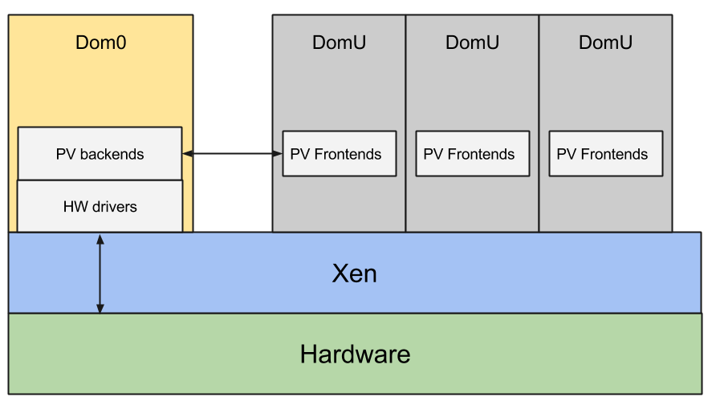
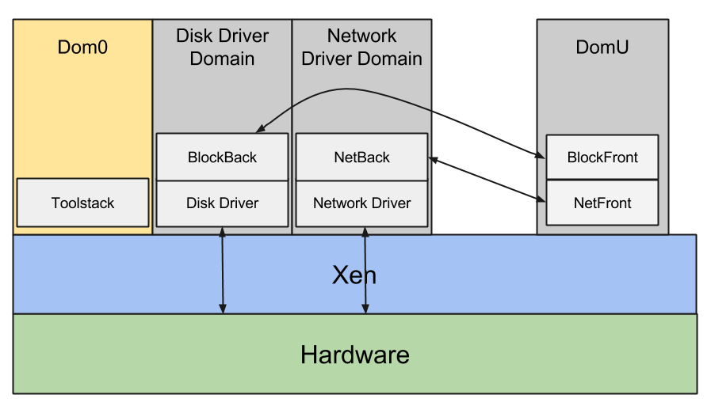

****************
Xen Architecture
****************

Xen is type-1 hypervisor: it runs directly on the hardware, everything else in the system is running as a virtual machine on top of Xen, including Dom0, the first virtual machine. Dom0 is created by Xen, is privileged and drives the devices on the platform. Xen virtualizes CPU, memory, interrupts and timers, providing virtual machines with one or more virtual CPUs, a fraction of the memory of the system, a virtual interrupt controller and a virtual timer. Xen assigns devices such as SATA controllers and network cards to Dom0, taking care of remapping MMIO regions and IRQs. Dom0 (typically Linux, but it could also be FreeBSD or other operating systems) runs the same device drivers for these devices that would be using on a native execution.

Dom0 also runs a set of drivers called paravirtualized backends to give access to disk, network, etc, to the other unprivileged virtual machines. The operating system running as DomU (unprivileged guest in Xen terminology) gets access to a set of generic virtual devices by running the corresponding paravirtualized frontend drivers. A single backend services multiple frontends. A pair of paravirtualized drivers exist for all the most common classes of devices: disk, network, console, framebuffer, mouse, keyboard, etc. They usually live in the operating system kernel, i.e. Linux. A few PV backends can also run in userspace in QEMU. The frontends connect to the backends using a simple ring protocol over a shared page in memory. Xen provides all the tools for discovery and to setup the initial communication. Xen also provides a mechanism for the frontend and the backend to share additional pages and notify each other via software interrupts.

Even though it is the most common configuration, there is no reasons to run all the device drivers and all the paravirtualized backends in Dom0. The Xen architecture allows driver domains: unprivileged virtual machines with the only purpose of running the driver and the paravirtualized backend for one class of devices. For example you can have a disk driver domain, with the SATA controller assigned, running the driver for it and the disk paravirtualized backend. You can have a network driver domain with the network card assigned, running the driver for it and the network paravirtualized backend. As driver domains are regular unprivileged guests, they make the system more secure because they allow large pieces of code, such as the entire network stack, to run unprivileged. Even if a malicious guest manages to take over the paravirtualized network backend and the network driver domain, it would not be able to take over the entire system. Driver domains also improve isolation and resilience: the network driver domain is fully isolated from the disk driver domains and Dom0. If the network driver crashes it would not be able to take down the entire system, only the network. It is possible to reboot just the network driver domains while everything else remains online. Finally driver domains allow Xen users to disaggregate and componentize the system in ways that would not be possible otherwise. For example they allow users to run a real-time operating system alongside the main OS to drive a device that has real time constraints. They allow users to run a legacy OS to drive old devices that do not have any new drivers in modern operating systems. They allow users to separate and isolate critical functionalities from less critical ones. For example they allow to run an OS such as QNX to drive most devices on the platform alongside Android for the user interface.

